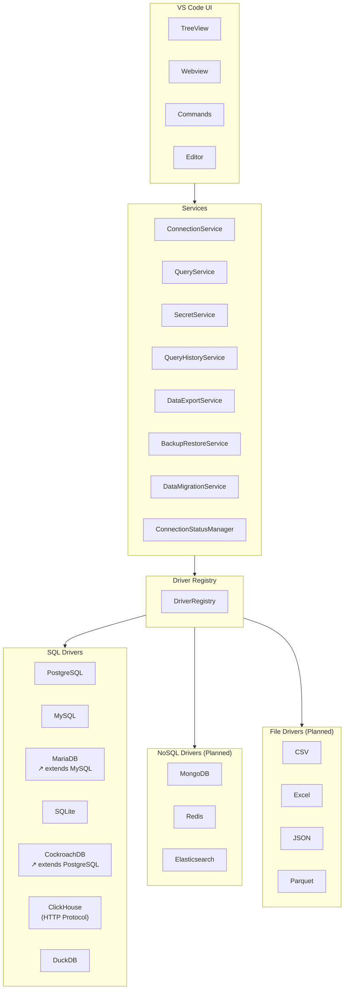
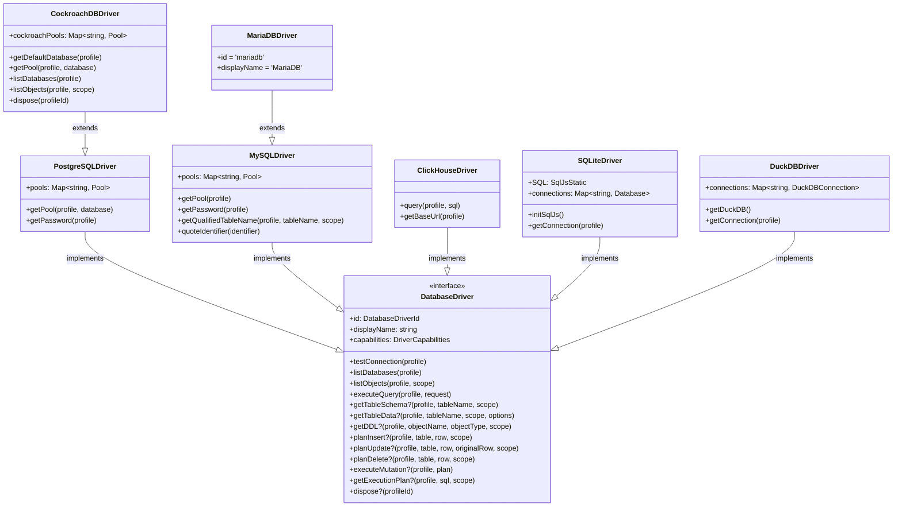
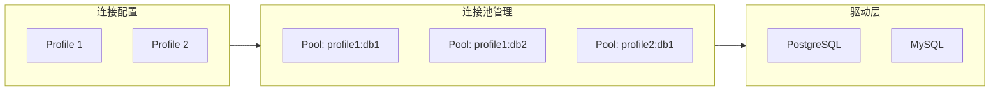
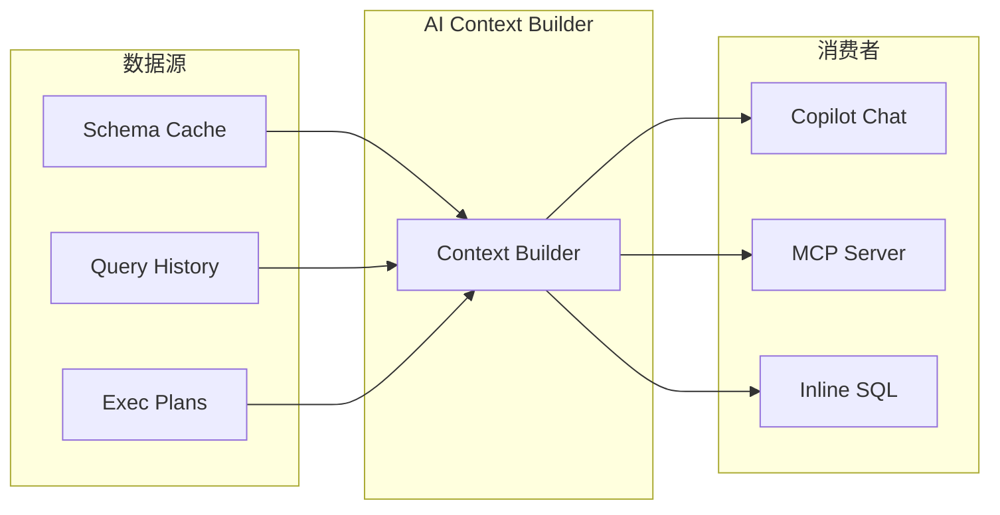

# DB Nexus 架构设计

## 设计目标

DB Nexus 是一个面向 VS Code 系编辑器（VS Code、Cursor、Windsurf 等）的多数据库工作台。架构设计遵循以下原则：

- **统一体验**：连接管理、Schema 浏览、查询执行、数据编辑走统一抽象
- **驱动可插拔**：每种数据库实现独立驱动，核心层不感知数据库差异
- **驱动继承**：相似数据库通过继承复用逻辑（MariaDB → MySQL，CockroachDB → PostgreSQL）
- **安全优先**：敏感信息使用 VS Code SecretStorage 存储
- **AI-Ready**：预留 Schema Context、Query History、MCP Provider 扩展点
- **渐进实现**：核心链路优先，高级能力按需扩展

## 分层架构



## 目录结构

```
src/
├── extension.ts              VS Code 激活入口
├── core/
│   ├── constants.ts          数据库类型、能力定义
│   ├── types.ts              核心类型定义
│   └── connectionStore.ts    连接配置存储
├── drivers/
│   ├── base.ts               驱动接口定义 + PlannedDriver
│   ├── registry.ts           驱动注册表
│   ├── postgresql.ts         PostgreSQL 驱动
│   ├── mysql.ts              MySQL 驱动
│   ├── mariadb.ts            MariaDB 驱动（继承 MySQL）
│   ├── sqlite.ts             SQLite 驱动
│   ├── cockroachdb.ts        CockroachDB 驱动（继承 PostgreSQL）
│   ├── clickhouse.ts         ClickHouse 驱动（HTTP 协议）
│   └── duckdb.ts             DuckDB 驱动
├── services/
│   ├── connectionService.ts      连接生命周期管理
│   ├── connectionStatusManager.ts 连接状态管理（EventEmitter）
│   ├── queryService.ts           查询执行服务
│   ├── queryHistoryService.ts    查询历史记录（GlobalState 持久化）
│   ├── secretService.ts          凭据安全存储
│   ├── dataExportService.ts      数据导入导出
│   ├── backupRestoreService.ts   备份恢复服务
│   └── dataMigrationService.ts   数据迁移服务（含 DDL 适配）
├── providers/
│   ├── connectionsTree.ts    连接树视图与节点定义
│   └── nodes.ts              树节点类型定义
├── webviews/
│   ├── connectionDashboard.ts    连接管理面板
│   ├── resultPanel.ts            查询结果面板
│   ├── tableDataPanel.ts         表数据面板
│   ├── tableSchemaPanel.ts       表结构面板
│   ├── tableListPanel.ts         表列表面板
│   ├── dataEditPanel.ts          数据编辑面板
│   ├── queryHistoryPanel.ts      查询历史面板
│   ├── executionPlanPanel.ts     执行计划面板
│   ├── erDiagramPanel.ts         ER 图面板
│   └── schemaComparePanel.ts     架构对比面板
└── i18n/
    └── index.ts              国际化服务
```

## 核心模型

### 连接模型

连接模型分为三层：

| 模型 | 用途 | 存储位置 |
|------|------|----------|
| `DbConnectionProfile` | 非敏感连接信息 | VS Code Settings |
| `DbSecretRef` | 敏感凭据引用 | VS Code SecretStorage |
| `DbConnectionSession` | 运行期连接实例 | 内存（不持久化） |

### 连接配置

`DbConnectionProfile` 包含基础和高级配置：

**基础配置**

| 字段 | 类型 | 说明 |
|------|------|------|
| `id` | string | 唯一标识 |
| `name` | string | 连接名称 |
| `driverId` | DatabaseDriverId | 数据库驱动 ID |
| `host` | string? | 主机地址 |
| `port` | number? | 端口号 |
| `database` | string? | 数据库名 |
| `username` | string? | 用户名 |
| `filePath` | string? | 文件路径（SQLite/DuckDB） |
| `ssl` | boolean? | SSL 连接 |
| `createdAt` | string | 创建时间 |
| `updatedAt` | string | 更新时间 |

**高级配置**

| 字段 | 类型 | 说明 |
|------|------|------|
| `clientDriver` | string? | 客户端驱动程序（default/native/http） |
| `charset` | string? | 客户端字符集（auto/utf8/utf8mb4） |
| `keepAliveInterval` | number? | 保持连接间隔（秒） |
| `connectTimeout` | number? | 连接超时（秒） |
| `readTimeout` | number? | 读取超时（秒） |
| `writeTimeout` | number? | 写入超时（秒） |
| `useCompression` | boolean? | 使用压缩 |
| `autoConnect` | boolean? | 自动连接 |
| `initialQuery` | string? | 初始查询 |
| `note` | string? | 备注 |

### 驱动能力

驱动能力使用 Capability Flags 定义：

```typescript
interface DriverCapabilities {
  schemaBrowse: boolean
  query: boolean
  dataEdit: boolean
  transactions: boolean
  explain: boolean
  erd: boolean
  importExport: boolean
  backupRestore: boolean
  streaming: boolean
}
```

不同数据库根据自身特性声明能力，例如：
- PostgreSQL / MySQL / MariaDB / CockroachDB：完整 SQL 能力
- ClickHouse：不支持事务、数据编辑、ER 图、备份恢复
- DuckDB：不支持备份恢复
- Redis：支持 Key 浏览和命令执行（计划中）

### Schema 作用域

```typescript
interface SchemaScope {
  database?: string
  schema?: string
  parentName?: string
}
```

不同数据库的层级模型：

| 数据库 | 层级结构 | 说明 |
|--------|----------|------|
| PostgreSQL | database → schema → table | database 和 schema 独立 |
| CockroachDB | database → schema → table | 继承 PostgreSQL 层级，过滤 crdb_% 系统Schema |
| MySQL / MariaDB | database → table | schema 等同于 database |
| ClickHouse | database → table | 单层结构 |
| SQLite | table | 无层级 |
| DuckDB | schema → table | 单层结构 |

## 驱动接口

所有数据库驱动实现统一接口：

```typescript
interface DatabaseDriver {
  id: DatabaseDriverId
  displayName: string
  capabilities: DriverCapabilities

  testConnection(profile): Promise<ConnectionTestResult>
  listDatabases(profile): Promise<DatabaseCatalog[]>
  listObjects(profile, scope): Promise<SchemaObject[]>
  executeQuery(profile, request): Promise<QueryResult>
  getTableSchema?(profile, tableName, scope): Promise<TableSchema>
  getTableData?(profile, tableName, scope, options): Promise<QueryResult>
  getDDL?(profile, objectName, objectType, scope): Promise<string>
  planInsert?(profile, table, row, scope): Promise<MutationPlan>
  planUpdate?(profile, table, row, originalRow, scope): Promise<MutationPlan>
  planDelete?(profile, table, row, scope): Promise<MutationPlan>
  executeMutation?(profile, plan): Promise<DataEditResult>
  getExecutionPlan?(profile, sql, scope): Promise<ExecutionPlan>
  dispose?(profileId): Promise<void>
}
```

未实现的驱动使用 `PlannedDriver` 占位，返回 "planned but not implemented" 消息。

### 驱动继承关系



驱动只负责数据库差异：
- 连接字符串和认证方式
- 元数据查询 SQL
- SQL 方言差异（分页语法、类型映射、标识符引用等）
- 执行计划格式解析
- 连接池管理（支持多数据库连接池隔离）

### 驱动实现要点

| 驱动 | 连接方式 | 连接池 | 特殊处理 |
|------|----------|--------|----------|
| PostgreSQL | `pg.Pool` | 按 `{profileId}:{database}` 隔离 | 支持 `EXPLAIN ANALYZE`，跨库查询 |
| MySQL | `mysql2/promise.Pool` | 按 `profileId` 隔离 | 反引号标识符，`SHOW CREATE TABLE` |
| MariaDB | 继承 MySQL | 继承 MySQL | 仅覆盖 id 和 displayName |
| SQLite | `sql.js` (WASM) | 单连接，按 `profileId` | 文件读写，PRAGMA 元数据 |
| CockroachDB | 继承 PostgreSQL | 独立 `cockroachPools` | 默认 SSL，过滤 crdb_% Schema |
| ClickHouse | HTTP/HTTPS | 无连接池 | JSON FORMAT，X-ClickHouse-User/Key 认证 |
| DuckDB | `duckdb` native | 单连接，按 `profileId` | 文件/内存模式，duckdb_tables() 元数据 |

### 表结构模型

```typescript
interface TableSchema {
  name: string
  columns: TableColumn[]
  indexes: TableIndex[]
  foreignKeys: TableForeignKey[]
  comment?: string
  metadata?: Record<string, string | number | boolean | null | undefined>
}
```

`metadata` 字段存储驱动特定的表元数据：

| 数据库 | metadata 字段 |
|--------|---------------|
| PostgreSQL | tableRows, owner, dataLength, indexLength, totalLength, serverVersion, charset, activeSessions, rowFormat, objectKind, comment, databaseName, tableCollation |
| MySQL / MariaDB | engine, tableRows, autoIncrement, dataLength, indexLength, maxDataLength, tableCollation, charset, serverVersion, activeSessions, rowFormat, createTime, updateTime, checkTime |
| SQLite | serverVersion, charset, schemaVersion, userVersion, pageCount, pageSize, dataLength, databaseSize, freeListCount, journalMode, tableRows |
| ClickHouse | engine, tableRows, dataLength, serverVersion, activeSessions, primaryKeys, sortingKey, partitionKey, createSql, updateTime |
| DuckDB | serverVersion, tableRows, columnCount, indexCount, checkCount, databaseSize, dataLength, databaseName, schemaName, createSql |
| CockroachDB | 继承 PostgreSQL metadata |

### 变更计划模型

```typescript
interface MutationPlan {
  table: string
  database?: string
  schema?: string
  type: 'insert' | 'update' | 'delete'
  sql: string
  description: string
}
```

`database` 字段确保跨库操作时使用正确的连接池。

### 执行计划模型

```typescript
interface ExecutionPlan {
  nodes: ExecutionPlanNode[]
  totalCost?: number
  totalRows?: number
  executionTime?: number
}

interface ExecutionPlanNode {
  id: string
  type: string
  name: string
  cost?: number
  rows?: number
  width?: number
  actualTime?: number
  actualRows?: number
  actualLoops?: number
  children?: ExecutionPlanNode[]
  details?: Record<string, unknown>
}
```

不同数据库的执行计划获取方式：

| 数据库 | 执行计划语法 | 说明 |
|--------|-------------|------|
| PostgreSQL | `EXPLAIN (ANALYZE, FORMAT JSON)` | 支持 cost、rows、actualTime，递归解析节点树 |
| MySQL | `EXPLAIN FORMAT=JSON` | JSON 格式输出 |
| SQLite | `EXPLAIN QUERY PLAN` | 简化计划 |
| ClickHouse | `EXPLAIN` | 支持 PLAN/TREE/JSON 格式 |
| DuckDB | `EXPLAIN` | 简化计划 |

## 服务层

服务层提供统一用户体验：

| 服务 | 职责 |
|------|------|
| ConnectionService | 连接生命周期、测试连接、Schema 加载 |
| ConnectionStatusManager | 连接状态管理（connected/disconnected/error/connecting），EventEmitter 通知 |
| QueryService | 查询执行、结果归一化、错误处理 |
| QueryHistoryService | 查询历史持久化（GlobalState，最多 100 条） |
| SecretService | 凭据安全管理（单例模式） |
| DataExportService | CSV/JSON/SQL 导入导出（静态方法） |
| BackupRestoreService | 数据库备份恢复（SQL/JSON 格式，进度通知） |
| DataMigrationService | 跨数据库数据迁移（批量、DDL 适配） |

### 备份恢复服务

```typescript
interface BackupOptions {
  includeData: boolean
  includeSchema: boolean
  tables?: string[]
  format: 'sql' | 'json'
}

interface RestoreOptions {
  dropExisting: boolean
  format: 'sql' | 'json'
}
```

备份恢复流程：
1. 用户选择备份内容（结构/数据/两者）
2. 选择输出格式（SQL/JSON）
3. 按表遍历 Schema（通过 `getDDL`）和数据（通过 `executeQuery`）
4. SQL 格式：生成 `CREATE TABLE` + `INSERT INTO` 语句
5. JSON 格式：每行一个 JSON 对象（`{type, name, ddl}` / `{type, table, rows}`）
6. 写入用户指定路径

### 数据迁移服务

```typescript
interface MigrationOptions {
  tables?: string[]
  batchSize: number
  includeData: boolean
  includeSchema: boolean
  dropExisting: boolean
}
```

迁移流程：
1. 选择源和目标连接
2. 选择迁移内容（结构/数据/两者）
3. 配置批次大小和冲突策略
4. 按表逐批迁移数据（`LIMIT/OFFSET` 分页）
5. DDL 适配：跨数据库类型映射（SERIAL↔AUTO_INCREMENT、TINYINT(1)↔BOOLEAN 等）

DDL 适配映射表：

| 源 → 目标 | 映射规则 |
|-----------|----------|
| PostgreSQL → MySQL | SERIAL → INTEGER AUTO_INCREMENT, BIGSERIAL → BIGINT AUTO_INCREMENT, TIMESTAMPTZ → TIMESTAMP, JSONB → JSON |
| MySQL → PostgreSQL | AUTO_INCREMENT → SERIAL, TINYINT(1) → BOOLEAN, DATETIME → TIMESTAMP |
| SQLite → MySQL | SERIAL → INTEGER, AUTO_INCREMENT → AUTOINCREMENT |

### 架构对比服务

```typescript
interface SchemaDifference {
  type: 'table_added' | 'table_removed' | 'table_modified' |
        'column_added' | 'column_removed' | 'column_modified' |
        'index_added' | 'index_removed' |
        'fk_added' | 'fk_removed'
  tableName: string
  details: string
  sourceValue?: string
  targetValue?: string
}
```

对比流程：
1. 分别获取源和目标的表列表
2. 检测新增/删除的表
3. 对公共表逐个对比列（名称、类型、可空性）、索引（名称）、外键（名称）
4. 差异分类展示（颜色编码）

## UI 层

UI 层基于 VS Code 扩展能力：

| 组件 | 类型 | 用途 |
|------|------|------|
| ConnectionsTree | TreeView | 连接树导航（ConnectionNode, SchemaNode, TableDetailGroupNode, FieldNode, IndexNode） |
| ConnectionDashboard | Webview | 连接管理面板（含高级配置、智能默认名） |
| ResultPanel | Webview | 查询结果展示 |
| TableDataPanel | Webview | 表数据编辑（过滤、排序、分页） |
| TableSchemaPanel | Webview | 表结构查看（分栏布局：列/索引/外键/DDL） |
| TableListPanel | Webview | 表列表展示（搜索、操作） |
| DataEditPanel | Webview | 数据编辑面板 |
| ExecutionPlanPanel | Webview | 执行计划可视化（节点树） |
| ERDiagramPanel | Webview | ER 图展示 |
| SchemaComparePanel | Webview | 架构对比（差异表格、颜色编码） |
| QueryHistoryPanel | Webview | 查询历史 |

Webview 只负责展示和交互，不直接连接数据库，所有数据操作通过服务层完成。

## 连接池架构



连接池 Key 格式：

| 驱动 | Key 格式 | 说明 |
|------|----------|------|
| PostgreSQL | `{profileId}:{database}` | 支持跨库查询，每个数据库独立连接池 |
| MySQL / MariaDB | `{profileId}` | 单连接池，通过 USE 切换数据库 |
| CockroachDB | `{profileId}:{database}` | 独立 cockroachPools，继承 PG 隔离策略 |
| SQLite | `{profileId}` | 单连接（sql.js WASM） |
| DuckDB | `{profileId}` | 单连接（native binding） |
| ClickHouse | 无连接池 | HTTP 请求，每次查询独立 |

- `dispose` 方法级联清理所有相关连接池
- PostgreSQL/CockroachDB 支持跨库查询

## 安全设计

- **凭据隔离**：密码、Token 存储在 VS Code SecretStorage（操作系统级加密）
- **配置分离**：连接配置存储在工作区设置，不包含敏感数据
- **危险操作确认**：DROP、TRUNCATE、DELETE without WHERE 需要用户确认
- **变更预览**：数据编辑先生成 Mutation Plan，展示 SQL 预览
- **资源清理**：删除连接时调用 `driver.dispose()` 清理连接池和驱动资源
- **SSL 默认**：CockroachDB 默认启用 SSL（`rejectUnauthorized: false`）

## AI 扩展预留

架构预留 AI 能力扩展点：



上下文服务可提供：
- 当前连接的表、字段、索引、外键
- 最近查询历史
- 数据库方言信息
- 执行计划上下文
