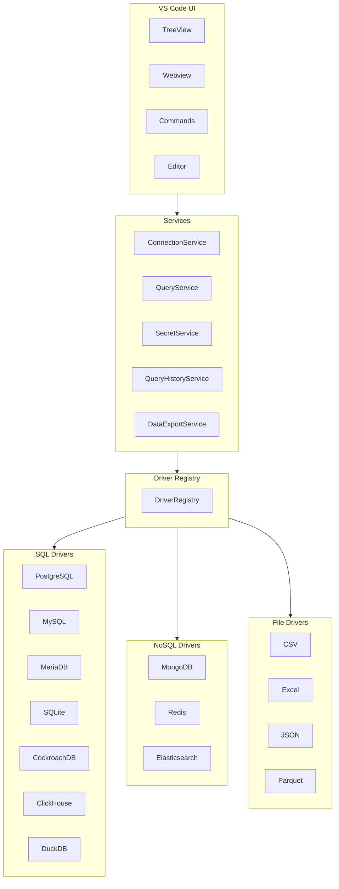
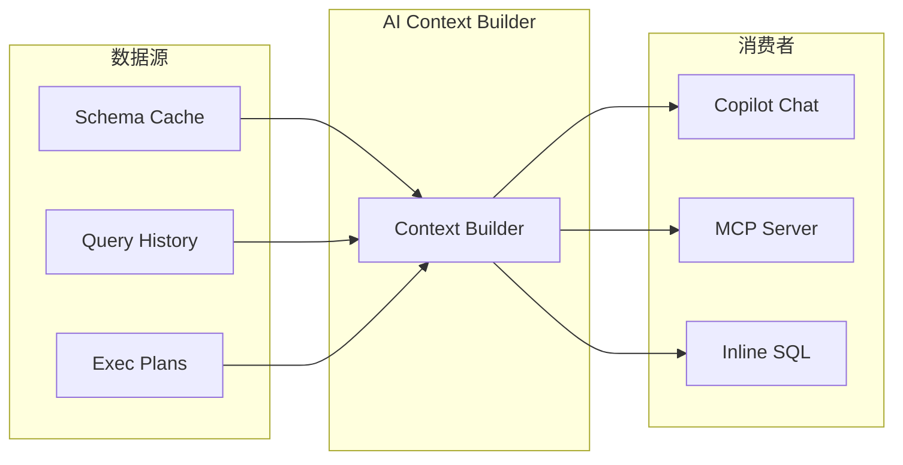

# DB Nexus 架构设计

## 设计目标

DB Nexus 是一个面向 VS Code 系编辑器（VS Code、Cursor、Windsurf 等）的多数据库工作台。架构设计遵循以下原则：

- **统一体验**：连接管理、Schema 浏览、查询执行、数据编辑走统一抽象
- **驱动可插拔**：每种数据库实现独立驱动，核心层不感知数据库差异
- **安全优先**：敏感信息使用 VS Code SecretStorage 存储
- **AI-Ready**：预留 Schema Context、Query History、MCP Provider 扩展点
- **渐进实现**：核心链路优先，高级能力按需扩展

## 分层架构



## 目录结构

```
src/
├── extension.ts              VS Code 激活入口
├── core/
│   ├── constants.ts          数据库类型、能力定义
│   ├── types.ts              核心类型定义
│   └── connectionStore.ts    连接配置存储
├── drivers/
│   ├── base.ts               驱动接口定义
│   ├── registry.ts           驱动注册表
│   ├── postgresql.ts         PostgreSQL 驱动
│   ├── mysql.ts              MySQL 驱动
│   ├── mariadb.ts            MariaDB 驱动
│   ├── sqlite.ts             SQLite 驱动
│   ├── cockroachdb.ts        CockroachDB 驱动
│   ├── clickhouse.ts         ClickHouse 驱动
│   └── duckdb.ts             DuckDB 驱动
├── services/
│   ├── connectionService.ts      连接生命周期管理
│   ├── queryService.ts           查询执行服务
│   ├── queryHistoryService.ts    查询历史记录
│   ├── secretService.ts          凭据安全存储
│   ├── dataExportService.ts      数据导入导出
│   ├── backupRestoreService.ts   备份恢复服务
│   └── dataMigrationService.ts   数据迁移服务
├── providers/
│   ├── connectionsTree.ts    连接树视图
│   └── nodes.ts              树节点定义
├── webviews/
│   ├── connectionDashboard.ts    连接管理面板
│   ├── resultPanel.ts            查询结果面板
│   ├── tableDataPanel.ts         表数据面板
│   ├── tableSchemaPanel.ts       表结构面板
│   ├── queryHistoryPanel.ts      查询历史面板
│   ├── executionPlanPanel.ts     执行计划面板
│   ├── erDiagramPanel.ts         ER 图面板
│   └── schemaComparePanel.ts     架构对比面板
└── i18n/
    └── index.ts              国际化服务
```

## 核心模型

### 连接模型

连接模型分为三层：

| 模型 | 用途 | 存储位置 |
|------|------|----------|
| `DbConnectionProfile` | 非敏感连接信息 | VS Code Settings |
| `DbSecretRef` | 敏感凭据引用 | VS Code SecretStorage |
| `DbConnectionSession` | 运行期连接实例 | 内存（不持久化） |

### 驱动能力

驱动能力使用 Capability Flags 定义：

```typescript
interface DriverCapabilities {
  schemaBrowse: boolean    // Schema 浏览
  query: boolean           // 查询执行
  dataEdit: boolean        // 数据编辑
  transactions: boolean    // 事务支持
  explain: boolean         // 执行计划
  erd: boolean             // ER 图生成
  importExport: boolean    // 数据导入导出
  backupRestore: boolean   // 备份恢复
  streaming: boolean       // 流式查询
}
```

不同数据库根据自身特性声明能力，例如：
- PostgreSQL：完整 SQL 能力
- ClickHouse：不支持事务和数据编辑
- Redis：支持 Key 浏览和命令执行

## 驱动接口

所有数据库驱动实现统一接口：

```typescript
interface DatabaseDriver {
  id: DatabaseDriverId
  displayName: string
  capabilities: DriverCapabilities
  
  testConnection(profile): Promise<ConnectionTestResult>
  listDatabases(profile): Promise<DatabaseCatalog[]>
  listObjects(profile, scope): Promise<SchemaObject[]>
  executeQuery(profile, request): Promise<QueryResult>
  getTableSchema?(profile, tableName, scope): Promise<TableSchema>
  getTableData?(profile, tableName, scope, options): Promise<QueryResult>
  getDDL?(profile, objectName, objectType, scope): Promise<string>
  planInsert?(profile, table, row, scope): Promise<MutationPlan>
  planUpdate?(profile, table, row, originalRow, scope): Promise<MutationPlan>
  planDelete?(profile, table, row, scope): Promise<MutationPlan>
  executeMutation?(profile, plan): Promise<DataEditResult>
  getExecutionPlan?(profile, sql, scope): Promise<ExecutionPlan>
  dispose?(profileId): Promise<void>
}
```

驱动只负责数据库差异：
- 连接字符串和认证方式
- 元数据查询 SQL
- SQL 方言差异（分页语法、类型映射等）
- 执行计划格式解析

## 服务层

服务层提供统一用户体验：

| 服务 | 职责 |
|------|------|
| ConnectionService | 连接生命周期、测试连接、Schema 加载 |
| QueryService | 查询执行、结果归一化、错误处理 |
| QueryHistoryService | 查询历史持久化 |
| SecretService | 凭据安全管理 |
| DataExportService | CSV/JSON/SQL 导入导出 |
| BackupRestoreService | 数据库备份恢复 |
| DataMigrationService | 跨数据库数据迁移 |

## UI 层

UI 层基于 VS Code 扩展能力：

| 组件 | 类型 | 用途 |
|------|------|------|
| ConnectionsTree | TreeView | 连接树导航 |
| ConnectionDashboard | Webview | 连接管理面板 |
| ResultPanel | Webview | 查询结果展示 |
| TableDataPanel | Webview | 表数据编辑 |
| TableSchemaPanel | Webview | 表结构查看 |
| ExecutionPlanPanel | Webview | 执行计划可视化 |
| ERDiagramPanel | Webview | ER 图展示 |

Webview 只负责展示和交互，不直接连接数据库，所有数据操作通过服务层完成。

## 安全设计

- **凭据隔离**：密码、Token 存储在 VS Code SecretStorage（操作系统级加密）
- **配置分离**：连接配置存储在工作区设置，不包含敏感数据
- **危险操作确认**：DROP、TRUNCATE、DELETE without WHERE 需要用户确认
- **变更预览**：数据编辑先生成 Mutation Plan，展示 SQL 预览

## AI 扩展预留

架构预留 AI 能力扩展点：



上下文服务可提供：
- 当前连接的表、字段、索引、外键
- 最近查询历史
- 数据库方言信息
- 执行计划上下文
